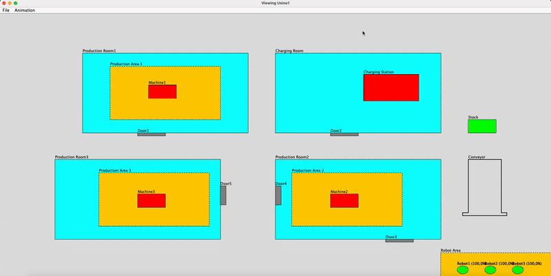

# 🏭 2D Robot Factory Simulator in Java

This project aims to create a **fully functional 2D simulation** of a robotized production factory, entirely implemented in Java.  
It simulates mobile robots moving through a structured factory layout, performing tasks such as transporting items, avoiding obstacles, managing energy levels, and recharging autonomously.

---

## ℹ️ About

This simulator was developed as part of an object-oriented programming course (`INF112`) at Télécom Paris.  
The project focuses on modeling and simulating a robot factory environment to put into practice core OOP principles, including:

- Abstraction and polymorphism
- Interfaces and delegation
- MVC architectural design
- Clean code structure and exception handling

Inspired by the **Cyber-Physical Systems Lab** at Hasso Plattner Institute of Potsdam, Germany ([link](https://www.hpi.uni-potsdam.de/giese/public/cpslab/)), this simulation is both a learning tool and a software design exercise.

---

## 🎯 Features

- ✅ Simulated 2D factory environment
- 🤖 Multiple mobile robots with customizable tasks
- 🔋 Energy consumption tracking and autonomous recharging behavior
- 🚧 Obstacle avoidance logic
- 💾 Save/load simulation state to disk
- 🖥️ Integrated GUI for visualization
- ⚠️ Robust exception handling (e.g., file access issues)

---

## 🛠️ Technologies Used

- Java (OOP design)
- Java Swing (for GUI rendering)
- Custom-built simulation engine
- Object-oriented design patterns (MVC, delegation, abstraction)

---

## 🧠 System Components

- **Factory**: The main environment, including rooms, doors, machines, and charging stations
- **Robot**: Simulated agents that navigate based on predefined routes
- **Production Machine**: Static factory elements that generate or process items (e.g., washers)
- **Charging Station**: Where robots automatically go when low on battery
- **Simulation Controller**: Coordinates robot movement and GUI updates
- **Graphical Interface**: A visual overview of the factory and robot actions

---

## 🎞️ Project Demo

A short video demo showing how the system works:

